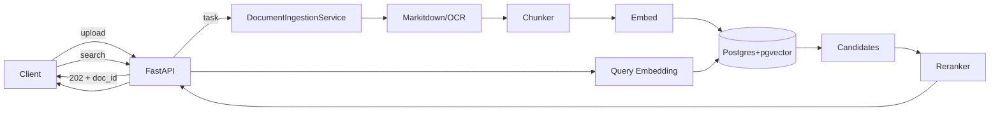

# Design Document

## Overview

本设计基于需求文档定义的独立 RAG 服务：FastAPI 提供 HTTP API；PostgreSQL + pgvector 存储分块向量；BGE-M3 负责查询/分块 embedding，BAAI/bge-reranker-v2-m3 负责 rerank。服务需支撑知识库隔离、文档摄取（含解析、分块、向量化）、语义检索与重排序，满足低延迟（单 KB≤100k chunk，p95≈300ms）、可观测与稳健错误处理。环境变量统一以 `RAG_` 前缀，错误响应遵循统一 schema，资源校验顺序：存在性→可用性→权限。

## Architecture

- **API 层（FastAPI）**：同步处理 CRUD 与检索；文档上传入口仅做参数校验后返回 202，摄取在后台任务执行。暴露 `/health`（存活）、`/ready`（就绪，检查 DB/模型加载）、`/metrics`（Prometheus）。
- **业务服务层**：
  - `KnowledgeBaseService`：知识库 CRUD、状态管理（enabled/disabled/deleted）、级联清理调度。
  - `DocumentIngestionService`：接收上传请求，生成 `document` 记录并将解析/分块/embedding 写入工作队列（可使用内置 background tasks；预留 Celery/RQ 接口）。
  - `Chunker`：基于 BGE-M3 tokenizer，按 `chunk_size`/`overlap` 切分 Markdown 文本，保留文件名、页码/序号元数据。
  - `EmbeddingService`：加载 BGE-M3，生成向量并 L2 归一化。
  - `VectorStore`：pgvector + HNSW（m=16, ef_construction=64, query 时 ef_search 默认 40）。
  - `RerankerService`：加载 bge-reranker-v2-m3，sigmoid 归一化得分。
  - `CleanupService`：对标记为 `deleted` 的知识库执行异步级联清理，支持重试与状态查询。
- **存储层**：PostgreSQL（pgvector 0.5+），表：knowledge_bases、documents、document_chunks、cleanup_tasks。事务确保摄取一致性（分块 embedding 全部成功才提交）。

Mermaid（请求/摄取/检索）：


## Components and Interfaces

- **Knowledge Base API**
  - `POST /knowledge_bases`：名称唯一创建，默认 `enabled`，返回 id/name/status/created_at。
  - `PATCH /knowledge_bases/{id}`：更新 name/description/status；`deleted` 后不允许修改；`disabled` 不可检索。
  - `DELETE /knowledge_bases/{id}`：标记 `deleted`，返回 `cleanup_task_id`（异步清理文档、分块、向量）。
  - `GET /knowledge_bases`：分页、名称模糊、状态过滤，返回 items+total。
  - `GET /cleanup_tasks/{task_id}` + `/retry`：查询/重试清理任务。
- **Document API**
  - `POST /knowledge_bases/{kb_id}/documents`：校验 KB 可用后返回 202 与 `document_id`、`status=processing`。支持 PDF/Word/Excel/PPT/TXT/Markdown/HTML/图片；超限 413；不支持 415。后台执行 markitdown+OCR→chunk→embedding→事务提交向量，成功置 `completed`，任意失败回滚并置 `failed`+error_message。
  - `GET /documents/{id}`：返回状态、chunk 计数、错误信息。
  - `GET /knowledge_bases/{kb_id}/documents`：分页+状态过滤。
  - `DELETE /documents/{id}`：删除文档及关联分块/向量，404/410 语义区分。
- **Search API**
  - `POST /search`：参数 query、knowledge_base_id、top_k(默认5，受 `RAG_MAX_TOP_K` 限制)。步骤：KB status=enabled；仅检索文档 `completed` 分块；pgvector cosine 距离取 min(top_k*3, `RAG_MAX_RERANK_CANDIDATES` 默认100) 候选；rerank 后返回 chunk_text、score(0-1)、document_id、filename、chunk_index。
- **Observability**
  - `GET /metrics`：Prometheus 指标（请求量/延迟、摄取成功/失败、活跃 KB、chunk 总数）。
  - 日志：JSON 结构化，携带 request_id、trace 信息、错误堆栈。
  - request_id：每次请求生成 UUID v4，写入响应头 `X-Request-ID` 与日志。
- **Configuration**
  - 环境变量前缀 `RAG_`：`RAG_MAX_DOCUMENT_SIZE`、`RAG_MAX_TOP_K`、`RAG_MAX_RERANK_CANDIDATES`、`RAG_HNSW_EF_SEARCH` 等。
  - 模型加载：BGE-M3、bge-reranker 持久驻留（优先 GPU，fallback CPU 并相应调整性能预期）。

## Data Models

- `knowledge_bases`：id (PK), name (unique), description, status(enum: enabled/disabled/deleted), created_at, updated_at.
- `documents`：id (PK), knowledge_base_id (FK), filename, status(enum: processing/completed/failed/deleted), error_message, chunk_count, created_at, updated_at.
- `document_chunks`：id (PK), knowledge_base_id (FK), document_id (FK), chunk_index, chunk_text, metadata(jsonb: filename, page_range, ocr_skipped), embedding(vector(1024)), created_at.
- `cleanup_tasks`：id (PK), knowledge_base_id (FK), status(enum: pending/running/completed/failed), progress(jsonb: processed,total,percentage), error_message, created_at, updated_at.
- 约束：删除/更新遵循存在性→可用性→权限校验；向量插入事务确保同一文档全量成功；HNSW 索引使用 `vector_cosine_ops`。

## Error Handling

- 统一错误响应：
```json
{
  "error": {
    "code": "KNOWLEDGE_BASE_NOT_FOUND",
    "message": "Knowledge base with id 'xxx' not found",
    "request_id": "uuid-v4",
    "details": [
      { "field": "knowledge_base_id", "code": "NOT_FOUND", "message": "Resource does not exist" }
    ]
  }
}
```
- 资源校验顺序：存在性→可用性（disabled/deleted）→权限（401/403）。
- 文档摄取失败：回滚已写入向量，文档标记 `failed` + error_message，可通过文档查询 API 获取。
- 内部异常：返回 500 `INTERNAL_ERROR`，日志记录堆栈+request_id，不暴露内部细节。

## Testing Strategy

- **单元测试**：服务层（KB 管理、分块策略、评分归一化、清理重试）、错误格式化、配置边界值（top_k、文档大小）。
- **集成测试**：使用 test Postgres+pgvector 容器；演练文档上传→分块→向量写入→搜索全链路（使用小型测试模型或 mock embedding/reranker 以降低资源消耗）。
- **契约/API 测试**：FastAPI TestClient 覆盖 2xx/4xx/5xx 分支，验证错误 schema、分页/过滤语义、状态机（deleted/disabled）限制。
- **性能与回归**：基于 pytest-benchmark 或 locust/hey 做烟囱式压测（单 KB 10k chunk 小规模）验证 p95、错误率；记录基线以对比回归。
- **可观测性验证**：检查 `/metrics` 输出的核心指标存在且标签符合预期；健康/就绪探针在依赖未就绪时正确返回 503。
